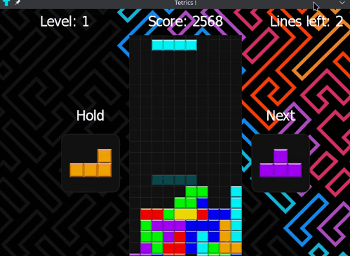

# Tetrics

A Tetris Game made in C#, displayed using WPF, originally made as a practic example for a technological watch report.

I wanted to experiment with C# and WPF. It include most major features expected for a tetris game, like the SRS (Super Rotation System), a "bag" system for tetrominos and a levelling system.
This game is very modular and can be easily extended (use of a lot of design patterns).

## Game controls

- ← → : move the piece
- ↑ : rotate clockwise
- ↓ : fast drop
- space : instant drop
- x : rotate counterclockwise
- c : put the current piece in reserve
- esc : stop the game

## How To Play 

1. Download the latest `TetriCS.zip` file from the latest [Release](https://github.com/Eralo/Tetrics/releases) available ! 
2. Unzip `TetriCS.zip`
3. Run `Tetrics.exe` (you will need .NET 6.0 runtime)

## Features

- Full Tetris core logic :
  -   Board and pieces logic
  -   SRS (Super Rotation System) allows for "advanced" rotation logic, such as wall kicks
  -   Reserve and preview next tetromino
  -   Bag randomizer generates balanced tetromino sequences
  -   Leveling and scoring system

- Very modular structure for game logic
- Extendable architecture using patterns (Factory, Observer, etc.)
- Clean WPF UI
- Keyboard controls & visual feedback
